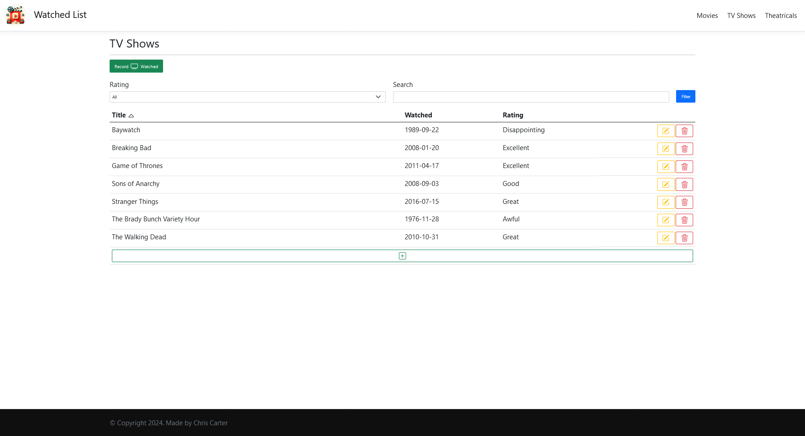

	
	<h1>Watched List</h1>

Welcome to the **Watched List** App!

This is a .NET project designed to demonstrate working with ASP.NET Core MVC, Entity Framework Core and Scaffolding when building a web application.

It allows users to view and record what movies, tv shows, or theatricals they have watched and give them a rating. 

## Features

- **Watched List Management**: Create, view, update and delete items on your watched list.
- **Filtering**: Filter watched lists by their rating and/or title.
- **Sorting**: Sort watches lists by any of the display columns.
- **Responsive Design**: A user-friendly interface designed to work on various devices.
- **Database Seeding**: Creates database if requires and inserts some initial data.

## Technologies

- .NET
- ASP.NET MVC
- Entity Framework Core
- SQL Server
- Bootstrap
- HTML
- CSS
- JavaScript

## Getting Started

**IMPORTANT!**

The InitialCreate database migration has been created.

The web application will migrate and created the database if required.

### Prerequisites

- .NET 8 SDK.
- A code editor like Visual Studio or Visual Studio Code.
- SQL Server.
- SQL Server Management Studio (optional).

### Installation

1. Clone the repository:
	- `git clone https://github.com/chrisjamiecarter/watched-list.git`

2. Navigate to the project directory:
	- `cd src\watched-list\WatchedList.Web`

3. Configure the application:
	- Update the connection string in `appsettings.json` if you require.

4. Build the application using the .NET CLI:
	- `dotnet build`

### Running the Application

1. Run the application using the .NET CLI in the project directory:
	- `dotnet run`

## Usage

Once the application is running, you can:

- Navigate the different categories by the Home page or the Navbar.
- Filter and sort a watched list using the dropdown, search input and/or column headers.
- Update/Delete a record by clicking on the associated icon/button in the watched list table.

### Home Page

### Movies Page

### TV Shows Page

### Theatricals Page

## How It Works

- **Menu Navigation**: Uses MVC and html pages to allow users to navigate the application.
- **Data Storage**: A new SQL Server database is created and the required schema is set up at run-time, or an existing database is used if previously created.
- **Data Access**: Interaction with the database is via Entity Framework Core.

## Database

## Contributing

Contributions are welcome! Please fork the repository and create a pull request with your changes. For major changes, please open an issue first to discuss what you would like to change.

## License

This project is licensed under the MIT License. See the [LICENSE](./LICENSE) file for details.

## Contact

For any questions or feedback, please open an issue.

---
***Happy Watched Listing!***
